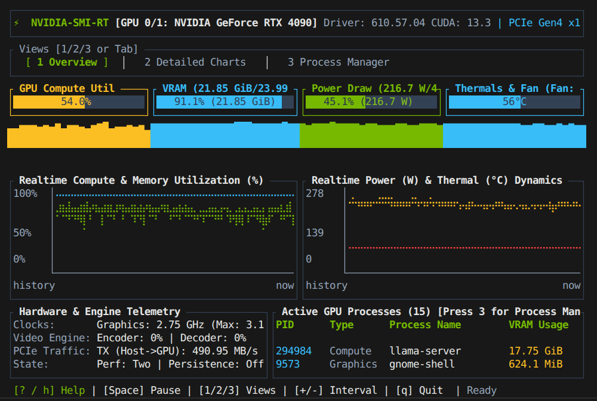
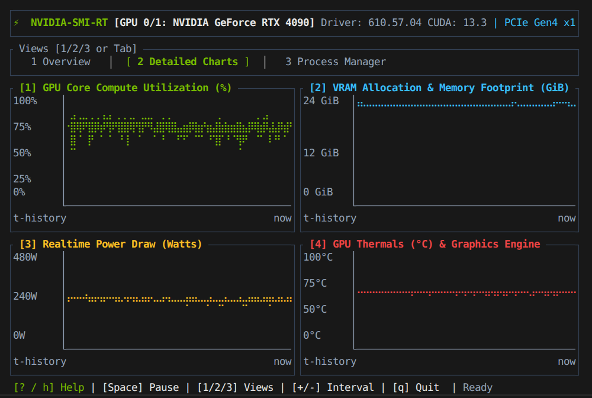
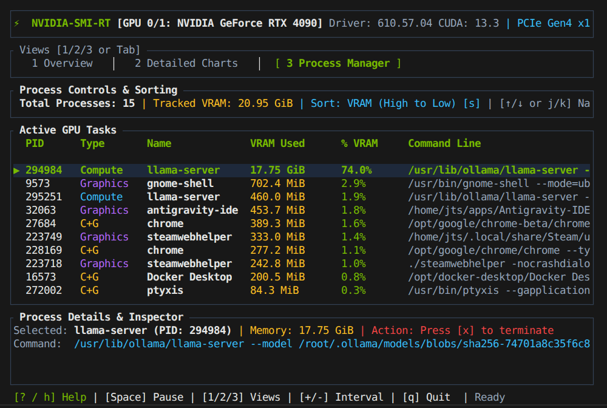

# ⚡ nvidia-smi-rt

A blazing-fast real-time NVIDIA GPU telemetry terminal dashboard and process manager written in Rust.

`nvidia-smi-rt` interfaces directly with NVIDIA drivers via high-performance NVML C bindings (with automatic `nvidia-smi` CLI fallback) to deliver low-overhead, sub-millisecond hardware telemetry with high-resolution Braille continuous line charts, sparklines, progress gauges, and an interactive process manager.



---

## 📸 Screenshots

| View | Preview |
| :--- | :--- |
| **1. Overview Dashboard**<br>Key metrics, live gauges, sparklines, dual Braille charts, PCIe bandwidth, video engine & active processes. | [](screenshots/main_screen.png) |
| **2. Detailed Charts**<br>High-resolution quad Braille coordinate plots for Compute %, VRAM GiB, Power Watts, and Thermals °C with rolling historical stats. | [](screenshots/charts_screen.png) |
| **3. Process Manager**<br>Sortable process table (Compute & Graphics), VRAM usage, interactive command line inspector, and SIGTERM termination. | [](screenshots/process_screen.png) |

---

## ✨ Features

- **🚀 Dual Telemetry Backends**:
  - **Native NVML (Default)**: Direct bindings to `libnvidia-ml.so` for zero-subprocess, low-latency sampling.
  - **`nvidia-smi` CLI (Fallback)**: Automatic fallback if NVML libraries are unavailable or run in restricted container environments.
- **📈 High-Resolution Braille Charts**: Continuous 2D time-series charts with Braille markers (providing 2×4 dot sub-cell resolution) for GPU Compute Utilization, VRAM footprint, Power Draw (Watts), and Thermals (°C).
- **📊 Real-time Gauges & Sparklines**: Instant visual feedback on core load, memory pressure, power envelope headroom, and fan curves.
- **🖥️ 3 Comprehensive Views**:
  1. **Overview**: Executive dashboard showing key gauges, sparklines, dual Braille time-series graphs, PCIe bus traffic, video encoder/decoder engine utilization, and top processes.
  2. **Detailed Charts**: Dedicated full-width quad-chart view with min / max / avg / current statistics and custom time axes.
  3. **Process Manager**: Interactive table showing all active GPU processes (Compute, Graphics, and C+G), memory usage, % allocation, full command line inspector, sorting, and safe process termination (`SIGTERM` with confirmation).
- **🕹️ Live Telemetry Controls**:
  - Dynamically speed up or slow down polling (`+` / `-` from 50ms to 5s).
  - Freeze/pause telemetry at any time (`Space`) to inspect transient spikes.
  - Multi-GPU support with instant switching (`Left` / `Right`).
- **📟 Non-Interactive Scripting & Snapshot Mode**:
  - Automatically prints a clean telemetry summary table if stdout is redirected or piped (`| head`, `| grep`).
  - Dedicated `-s, --snapshot` flag for quick checks.

---

## 🛠️ Installation & Building

### Prerequisites

- Rust 1.74+ / Cargo (`curl --proto '=https' --tlsv1.2 -sSf https://sh.rustup.rs | sh`)
- NVIDIA Proprietary Driver installed with `libnvidia-ml.so` or `nvidia-smi`

### Install via Cargo

From [crates.io](https://crates.io/crates/nvidia-smi-rt):
```bash
cargo install nvidia-smi-rt
```

Or install the latest development version directly from GitHub:
```bash
cargo install --git https://github.com/jtstogner/nvidia-smi-rt.git
```

### Build from source

```bash
git clone https://github.com/jtstogner/nvidia-smi-rt.git
cd nvidia-smi-rt
cargo build --release
```

The optimized binary will be available at `./target/release/nvidia-smi-rt`.

To install locally to your Cargo bin (`~/.cargo/bin`):
```bash
cargo install --path .
```

---

## 🚀 Usage

### Interactive TUI Dashboard

```bash
# Launch with default 500ms sampling
nvidia-smi-rt

# Launch with 200ms ultra-fast sampling
nvidia-smi-rt -i 200

# Monitor GPU index 1 on a multi-GPU workstation
nvidia-smi-rt -g 1

# Force nvidia-smi CLI fallback mode
nvidia-smi-rt --no-nvml
```

### Snapshot Mode

```bash
# Print a single-shot telemetry summary and exit
nvidia-smi-rt --snapshot

# Output can also be safely piped to tools like grep or jq
nvidia-smi-rt | grep "Compute Util"
```

---

## ⌨️ Keyboard Shortcuts

| Key | Action |
| :--- | :--- |
| `1` / `2` / `3` | Switch views: `[1] Overview`, `[2] Detailed Charts`, `[3] Process Manager` |
| `Tab` / `Shift+Tab` | Cycle through views |
| `Space` | Freeze / Resume telemetry sampling |
| `+` / `=` | Increase polling speed (decrease interval by 100ms) |
| `-` / `_` | Decrease polling speed (increase interval by 100ms) |
| `←` / `→` | Switch active GPU (multi-GPU workstations / servers) |
| `r` | Trigger immediate telemetry refresh |
| `↑` / `↓` (or `j` / `k`) | Navigate processes in Process Manager |
| `s` | Cycle process sorting mode (VRAM High/Low, PID, Name) |
| `x` / `Delete` | Terminate selected process (SIGTERM confirmation prompt) |
| `?` / `h` / `F1` | Toggle Help dialog |
| `q` / `Esc` | Quit dashboard |

---

## 🏗️ Architecture

```
src/
├── main.rs          # CLI argument parsing, terminal lifecycle, and panic safety hooks
├── app.rs           # Application state, ring buffer histories, navigation, key routing
├── telemetry/
│   ├── mod.rs       # TelemetryEngine dispatcher and auto-backend selection
│   ├── nvml_backend.rs # Direct libnvidia-ml.so C bindings implementation
│   ├── cli_backend.rs  # Fallback parser for nvidia-smi query commands
│   └── types.rs     # GpuSnapshot, GpuProcess, and MetricSeries time-series buffers
├── ui/
│   ├── mod.rs       # UI layout coordinator and status bar
│   ├── theme.rs     # Curated NVIDIA Green aesthetic palette & styling helpers
│   ├── header.rs    # Real-time top bar (GPU badge, drivers, PCIe, clock, tab bar)
│   ├── overview.rs  # Overview tab: gauges, sparklines, Braille charts, hardware & processes
│   ├── charts.rs    # Detailed quad Braille continuous coordinate charts with min/avg/max
│   ├── processes.rs # Interactive sortable process table with command line inspector
│   └── modals.rs    # Help guide popup and safe SIGTERM termination confirmation modal
└── utils.rs         # Formatting helpers (bytes to GiB, watts, temps) and /proc reader
```

---

## 📜 License

MIT License.
